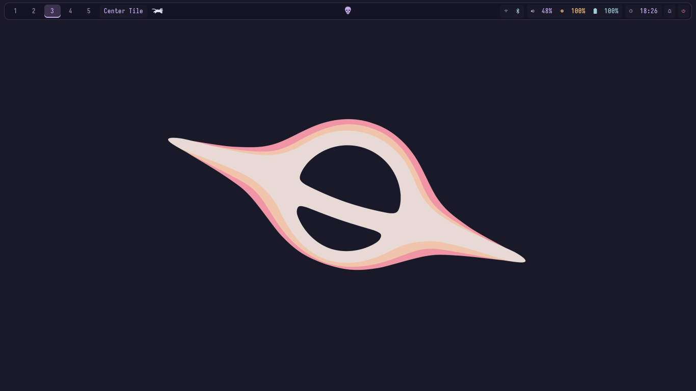
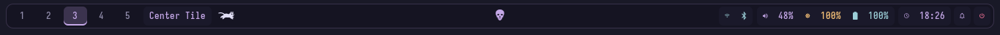

# ARCHNEMESIS · MangoWC

Familiar Hyprland controls. Mango’s native compositor, tags, and layouts.

A compact personal MangoWC configuration with Rose Pine inspired purple and pink accents, rounded borders, a dark desktop, and the ARCHNEMESIS application workflows.



## The desktop

- **Seven native layouts**, cycled with **Super + L**: Tile → Scroller → Center Tile → Grid → Deck → Monocle → Vertical Scroller → Tile.
- **Five tags always visible** in Waybar. Tags 6–10 appear when occupied or active.
- **Full layout names** in the bar. Click the name to cycle; right-click for overview.
- **Compact geometry**: 4 px inner gaps, 8 px outer gaps, 2 px borders, 10 px corners.
- **Bundled Rofi workflows** for applications, clipboard, wallpapers, and power actions.
- **SwayNC notifications**, PipeWire volume, playerctl media controls, and brightnessctl brightness.
- Mango experiments live under **Super + Ctrl + Alt**, away from everyday shortcuts.



These are actual captures of the running desktop. The desktop screenshot uses an empty Center Tile tag to show the wallpaper and bar without exposing open applications. The default wallpaper is included under `wallpapers/`.

## Structure

```text
.
├── install.sh
├── config.conf
├── config/                 # Eight compositor modules
├── scripts/                # Launcher, clipboard, screenshot, lock, bar helpers
├── themes/
│   ├── rofi/               # Launcher, wallpaper, power menu
│   ├── hyprlock.conf
│   ├── waybar.css
│   └── swaync/             # Notification configuration and stylesheet
├── wallpapers/default.png
├── waybar.jsonc
├── tests/verify_install.py
└── screenshots/            # Actual desktop and bar captures
```

`config.conf` sources the eight modules. Scripts retain the bundled themed workflows while keeping Mango-generated lock configuration and wallpaper state inside `~/.config/mango/`.

## Everyday controls

| Keys | Action |
| --- | --- |
| Super + Return | Kitty |
| Super + B | Helium browser |
| Super + E | Dolphin |
| Super + Space | Existing Rofi launcher |
| Super + G | Kdenlive |
| Super + N | Neovim inside Kitty |
| Super + W | Close focused window |
| Super + H / J / K | Focus left / down / up |
| Super + arrows | Directional focus |
| **Super + L** | **Cycle the seven native layouts** |
| Super + left / right mouse drag | Move / resize |
| Super + 1…9 / 0 | View tags 1…9 / 10 |
| Super + Shift + 1…9 / 0 | Move window to tag and follow |
| Super + S / Shift + S | Toggle special tag / send window there |
| Super + mouse wheel | Previous / next occupied tag |
| Three-finger swipe left / right | Next / previous tag |
| Alt + Z or Print | Region screenshot: save, copy, notify |
| Shift + Print | Full screenshot: save, copy, notify |
| Super + V | Rofi + cliphist clipboard |
| Super + Alt + Space | Wallpaper picker |
| Super + Alt + L | Wallpaper-aware Hyprlock |
| Volume / microphone keys | wpctl volume and mute |
| Brightness keys | brightnessctl |
| Media keys | playerctl |

The power icon at the far right opens the bundled styled Rofi menu: lock, suspend, logout, reboot, and shutdown. Logout dispatches Mango’s `quit`; other session actions retain confirmation dialogs.

## Optional Mango controls

Every shortcut below starts with **Super + Ctrl + Alt**. “Shift” means adding Shift to that same prefix.

| Additional key | Native action |
| --- | --- |
| 1…7 | Select Tile, Scroller, Center Tile, Grid, Deck, Monocle, Vertical Scroller |
| − / = | Decrease / increase master area |
| Shift + − / = | Decrease / increase master count |
| Return | Promote to master |
| P / Shift + P | Cycle scroller width presets / full width |
| Arrows / Shift + arrows | Scroller stack / exchange neighboring windows |
| H / J / K / L | Join group toward left / down / up / right |
| , / . / Shift + . | Previous group member / next member / leave group |
| Tab / Shift + Tab | Overview / current-tag overview |
| A | Jump mode |
| Q / Shift + Q | Thumbnail switcher next / previous |
| F1…F10 | Toggle tags in the current view |
| Shift + F1…F10 | Toggle focused window’s tag membership |
| Shift + A | View all tags |
| F / Shift + F | Fullscreen / maximize |
| C / O / G | Floating / overlay / global window |
| S | Toggle scratchpad |
| Shift + S / Shift + R | Minimize / restore |
| Backtick | Named scratch Kitty |
| R | Reload Mango configuration |

Try opening several windows and pressing Super + L. Scroller offers horizontal columns; Center Tile puts the master in the middle; Deck and Monocle provide different stacking behaviors. Use the isolated shortcuts to try groups, overview, tag combinations, and scratchpads without changing the familiar controls.

## Bundled workflows and requirements

The configuration is self-contained: Rofi themes and helpers, clipboard integration, screenshot workflow, Waybar styling and helper scripts, lock template, SwayNC styling, battery notifications, and a default wallpaper are included. **Hyprland and pre-existing Rofi/Waybar/Hyprlock configs are not required.** Files install only inside `~/.config/mango/`.

Validated with **MangoWC 0.17.5** and **Waybar 0.15.0**. Waybar needs `ext/workspaces` support; full layout names use Mango IPC through `mmsg` and `jq`.

Applications are separate dependencies: Kitty, Helium (`helium-browser`), Dolphin, Kdenlive, Neovim, Rofi with Wayland support, cliphist, wl-clipboard, grim, slurp, libnotify (`notify-send`), swaybg, Hyprlock, SwayNC, WirePlumber (`wpctl`), brightnessctl, playerctl, Bash, Python 3, and jq. Install those through your preferred package manager; the installer reports missing tools and does not install packages.

Optional bar actions use btop, pulsemixer, nmtui, bluetui, cava, calcurse, and yazi. Battery notifications use `flock` and automatically find a laptop battery. Desktop/session actions assume systemd and a working user D-Bus session.

For the original typography, install Iosevka/JetBrains Mono/Space Mono Nerd Fonts and an icon font with the displayed glyphs. The optional Waycat and Skulltype fonts enable the animated bar art; without them the helpers show a static cat/skull. Fonts, WhiteSur icons, Bibata-Modern-Ice cursors, and qt6ct/Kvantum are not redistributed. Missing fonts or icon/cursor themes may change the appearance but do not require your old app configurations.

The wallpaper picker uses the existing `~/Pictures/Wallpapers/CozyPixels/Catppuccin/Space & Cosmic` collection when available, otherwise the bundled `~/.config/mango/wallpapers/`. Set `MANGO_WALLPAPER_DIR` in the session environment to use another directory. Startup and locking use the current Mango wallpaper or the bundled default. Add your own images to the bundled directory to expand the picker. The default artwork was copied from the existing wallpaper collection; no ownership of third-party artwork or fonts is claimed.

Existing SwayNC services/processes take precedence. If neither is active, Mango starts SwayNC with its bundled configuration and style. Audio remains service-managed. Clipboard, Waybar, wallpaper, and battery startup avoid duplicate processes. No Hyprland-only daemons are started.

## Automated installation

With MangoWC, Python 3, Git, and curl already installed:

```sh
curl -fsSL https://raw.githubusercontent.com/nihitdev/mangoWC-config/main/install.sh | bash -s -- --repo https://github.com/nihitdev/mangoWC-config.git
```

The bootstrap clones the public repository into `~/.local/share/mangoWC-config`, enters it, and runs its installer. No home directory or OS username is hardcoded. Repository URLs identify this GitHub project; forks can supply their own URL with `--repo` or `MANGO_REPO_URL`.

Already cloned? Run:

```sh
./install.sh --check
./install.sh
```

The installer stages and validates all Mango modules, checks Bash/Python syntax, bundled assets, and JSON, and reports missing applications. It then replaces only repository-owned files under `~/.config/mango/` and validates the installed configuration. Runtime wallpaper state and generated lock configuration remain in place. No backups or packages are created, and other application configs are untouched. ShellCheck runs when available.

Missing applications are reported but do not prevent installation. Every configuration, helper, and theme used by these workflows is bundled; software packages and fonts remain separate dependencies. The backlight module lets Waybar discover the device rather than naming a particular laptop controller.

Options:

```sh
./install.sh --help
# Bootstrap into a different location:
curl -fsSL https://raw.githubusercontent.com/nihitdev/mangoWC-config/main/install.sh | bash -s -- --repo https://github.com/nihitdev/mangoWC-config.git --clone-dir "$HOME/Projects/mangoWC-config"
```

`--branch` selects a branch when cloning; it defaults to `main`. `--check` skips deployment (bootstrap still clones). Existing clone destinations are never overwritten or reset: rerun their `./install.sh` directly, and use Git to update them when desired. Run as your desktop user. The installer deploys to `~/.config/mango`, matching the home-relative configuration and bundled workflows.

Log into Mango after installation, or press **Super + Ctrl + Alt + R** inside Mango to reload. The installer does not restart your current desktop or bar.

## Validate

```sh
mango -c ~/.config/mango/config.conf -p
bash -n install.sh
for script in scripts/*.sh; do bash -n "$script"; done
shellcheck install.sh scripts/*.sh scripts/cliphist-rofi
jq empty waybar.jsonc
python3 tests/verify_install.py
```

Keep `-c` before `-p`: Mango’s parse check uses the configuration selected at that point. The parser check does not verify that application packages or services exist. Runtime wallpaper links and generated lock configuration are excluded from Git.
